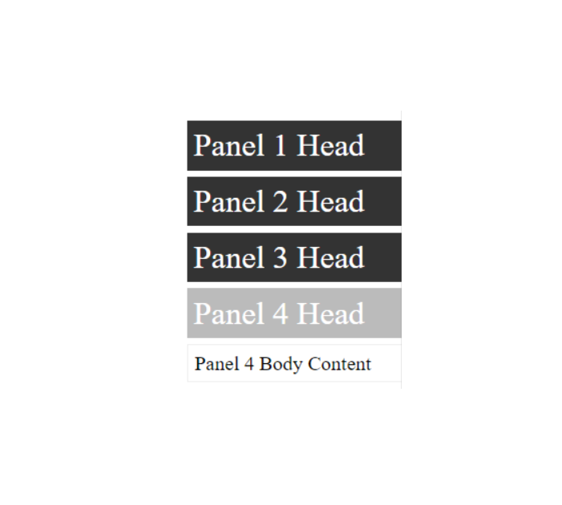

# JavaScript-Accordion

Accordion typically contains a list of panels that open and close. The panels are HTML and open close is done with JavaScript. Panels have a head which is always showing and body which is toggled to show or not.

# Image

